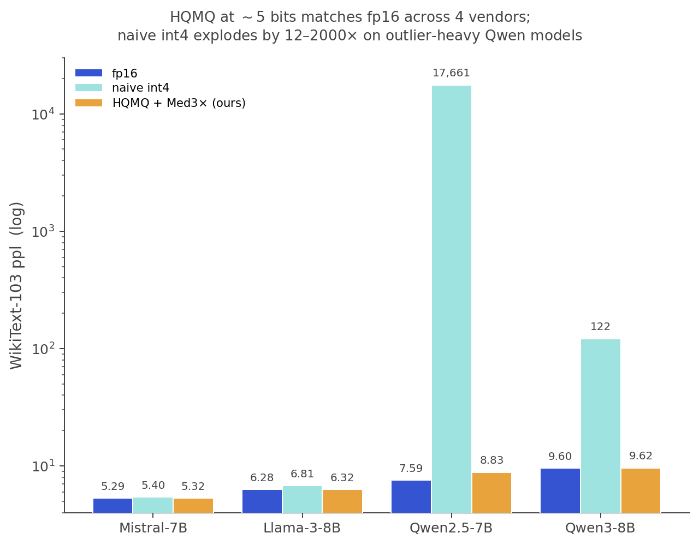
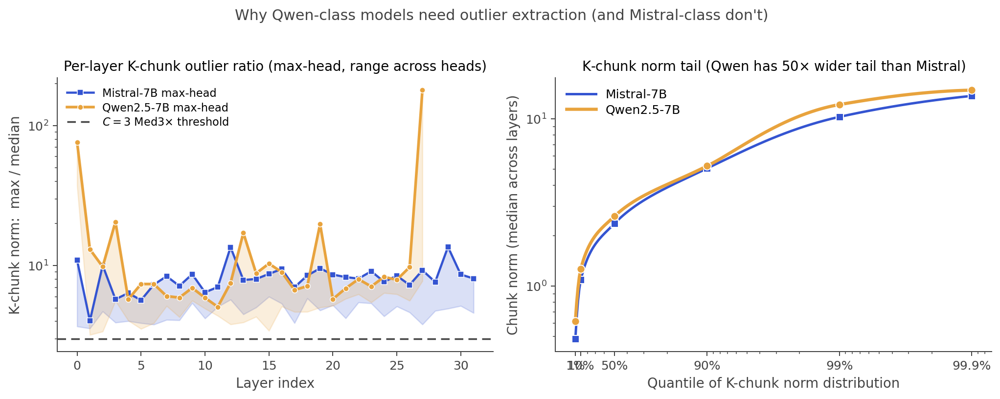
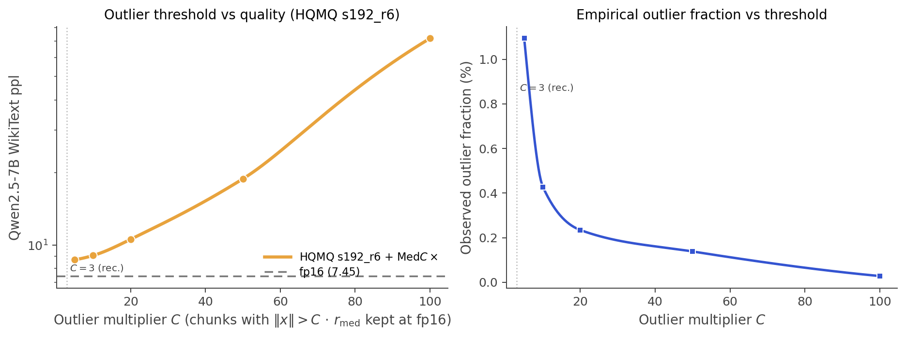
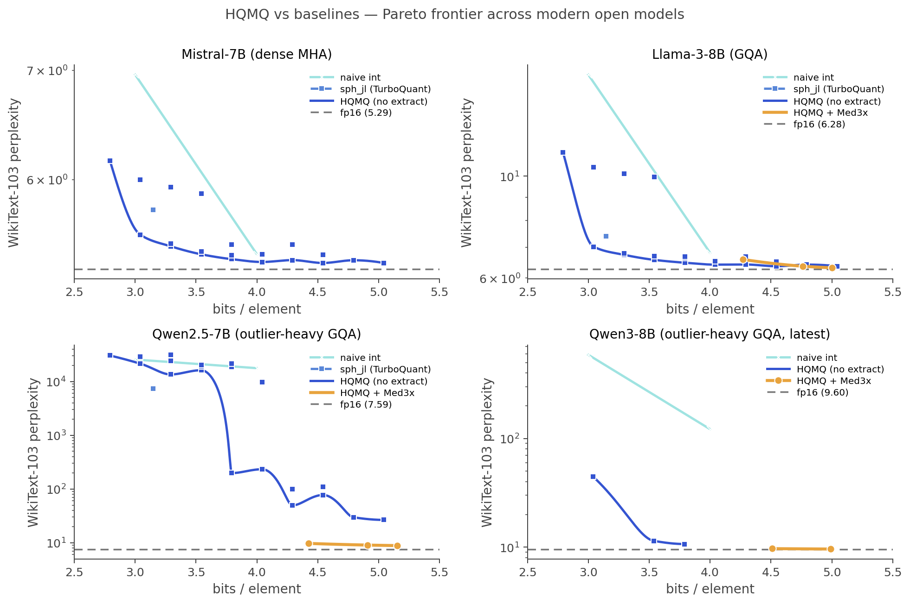
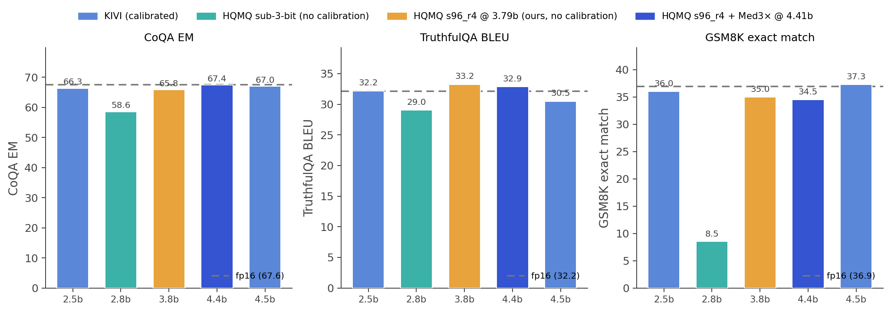
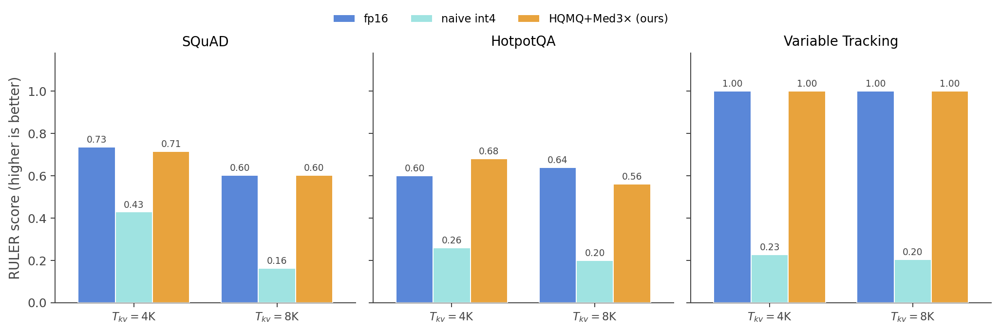
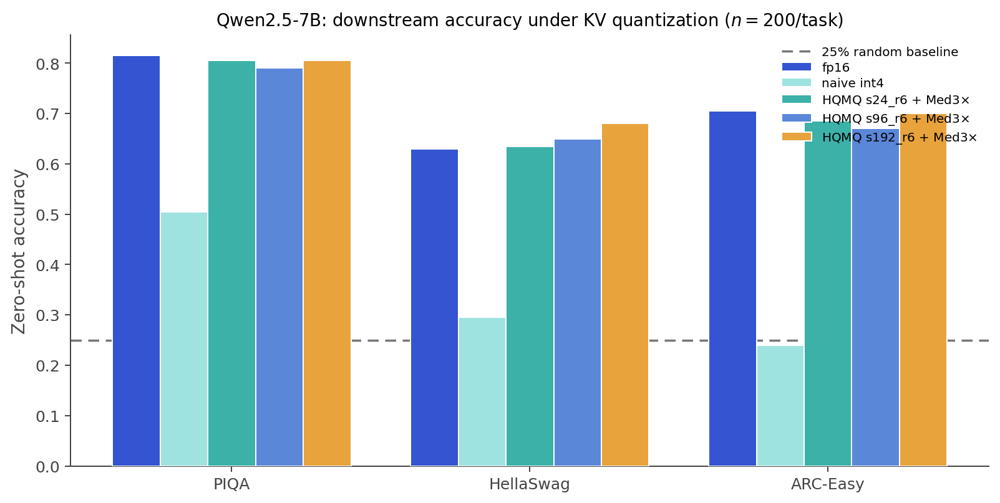
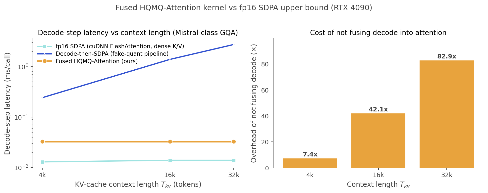
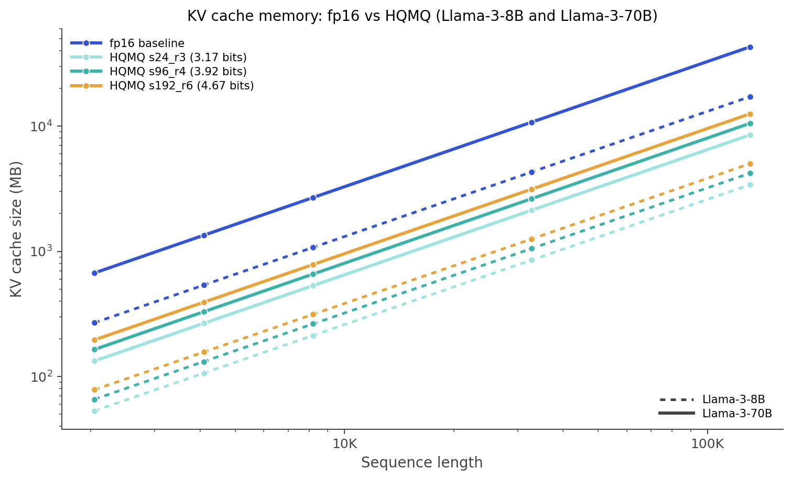

# HQMQ: Hurwitz Quaternion Multiplicative Quantization for KV Cache

<p align="center">
  <a href="#">Project Page</a> &nbsp;·&nbsp;
  <a href="#">Paper</a> &nbsp;·&nbsp;
  <a href="#">arXiv</a>
</p>

<p align="center">
  
</p>

**Calibration-free** KV cache quantization that quantizes each 4-element K/V chunk's direction to the product $q_p \cdot q_s$, with $q_p \in 24$-cell (Hurwitz group) and $q_s$ a random unit quaternion. **5× KV memory compression** at $\Delta \leq 0.10$ ppl points from fp16 on five modern open LLMs, matches calibrated **KIVI-4** at **16% fewer bits without any calibration pass**, and ships a fused Triton attention kernel that decodes from the compressed cache in-place — within $\sim 2.5\times$ of dense fp16 SDPA at all tested context lengths.

---

## TL;DR

- **What.** Direction of each 4-element K/V chunk is quantized to $q_p \cdot q_s$. The 24 fixed $q_p$ are the Hurwitz group; the $S$ learned-or-random $q_s$ are per-(layer, head). Multiplicative composition yields $24S$ effective codewords from $S$ stored params.
- **Why.** The 24-cell is simultaneously the optimal $S^3$ arrangement **and** a multiplicative group. Composing it with random Haar rotations gives a rate-optimal $S^3$ packing **without calibration** (Proposition 4.1).
- **Outliers.** A 1-bit per-batch median-multiplier extraction ($C{=}3$, stable across every tested architecture — no per-model tuning) handles outlier-heavy attention (Qwen, gpt-oss-class).
- **Production.** Fused Triton attention kernel reads compressed KV in-place: $0.033$ ms/decode step at any context length, within $\sim 2.5\times$ of dense fp16 SDPA on a 5× smaller cache.

---

## Mechanics

### 1. Chunk → quaternion

For an attention layer with $H$ KV heads and per-head dim $d_h$ (divisible by 4), each K or V vector $x \in \mathbb{R}^{d_h}$ is split into $n = d_h / 4$ chunks. Each chunk is a quaternion in $\mathbb{H} \cong \mathbb{R}^4$. We separately quantize:

- the **radius** $r = \|x_{\text{chunk}}\|$ to $b_r$ bits (uniform scalar, per-token-max scale), and
- the **unit direction** $u = x_{\text{chunk}} / r \in S^3$ via codebook lookup.

### 2. Codebook

The primary codebook is the 24 Hurwitz unit quaternions, $\mathcal{P} = \{\pm 1, \pm i, \pm j, \pm k\} \cup \{\tfrac{1}{2}(\pm 1 \pm i \pm j \pm k)\}$. They are simultaneously: vertices of the **24-cell**, the **optimal $S^3$ kissing arrangement** (24 points at min angle $60°$), and a **group of order 24** under quaternion multiplication (the binary tetrahedral group $2T$).

The secondary codebook $\mathcal{S}_{\ell,h,m} = \{q_{s,1}, \dots, q_{s,S}\}$ is **$S$ random unit quaternions per (layer, head, K|V)**. The joint codebook is the multiplicative product set $\mathcal{C} = \{q_p \cdot q_s : q_p \in \mathcal{P}, q_s \in \mathcal{S}\}$: $24S$ codewords on $S^3$ from only $S$ stored parameters.

### 3. Why random initialization works

Left-multiplication by a unit quaternion is an $S^3$ isometry. Each $q_s$ rotates the 24-cell to a fresh isometric copy of itself (same min angle $60°$), and $S$ independent Haar rotations of a kissing-number arrangement give a quasi-uniform $24S$-point packing.

**Proposition 4.1.** Let $q_{s,i}$ be i.i.d. Haar-uniform on $S^3$. Then $|\mathcal{C}| = 24S$ a.s. and $\mathbb{E}[\rho(\mathcal{C})] = O((24S)^{-1/3})$ — matching the optimal $S^3$ covering rate up to constants.

**Empirically:** across 5 random seeds on Mistral-7B, end-task perplexity varies by $\leq 0.14\%$ — no calibration required.

### 4. Outlier extraction (Med3×)

Modern outlier-heavy architectures (Qwen2.5/3, gpt-oss-class) have a tail of K-chunks with $K_{\max} / K_{\mathrm{med}} > 100\times$. Per-batch median-multiplier extraction handles this with no calibration:

```text
for each (layer, head, K|V), per batch:
    r_med = median(chunk_norms)
    outlier_mask = chunk_norms > C * r_med    # C = 3
    quantize non-outliers via HQMQ
    keep outliers at fp16 (with 1-bit per-chunk flag)
```

$\sim 1$–3% of chunks extracted at $C{=}3$, adding $\sim 0.15$ bits/element.

<p align="center">
  
  <br>
  <em>Why Qwen-class models need extraction: Qwen2.5's per-layer K-chunk max/median is $\sim 50\times$ wider than Mistral's.</em>
</p>

<p align="center">
  
  <br>
  <em>Outlier-multiplier sweep: extracting $\sim 0.5$–1% of chunks ($C{=}3$–5) closes most of the gap to fp16.</em>
</p>

### 5. Bit accounting

Per-element bits: $b_{\text{HQMQ}} = (\log_2(24S) + b_r) / 4 + 16/d_h$, plus $\sim 0.15$ for Med3× extraction.

| Config | bits/element | vs fp16 |
|---|---|---|
| s24_r3 | 3.17 | **5.05×** smaller |
| s96_r4 | 3.92 | 4.08× |
| s192_r6 | 4.67 | 3.43× |

---

## Results

### Five-model coverage (WikiText-103 perplexity)

| Model | Arch | fp16 ppl | Best HQMQ ppl (bits) | $\Delta\,/$ fp16 |
|---|---|---|---|---|
| Mistral-7B | dense MHA | 5.29 | 5.32 (5.07b) | $+0.5\%$ |
| Llama-3-8B | dense GQA | 6.28 | 6.32 (5.00b) | $+0.6\%$ |
| Qwen2.5-7B | outlier GQA | 7.59 | 8.83 (5.15b) | $+16\%$ |
| Qwen3-8B | outlier GQA | 9.60 | 9.62 (4.99b) | $+0.2\%$ |
| gpt-oss-20b | sparse MoE | 446.8† | 460.4 (5.25b) | $+3.0\%$ |

WikiText-103 sliding-window (50 windows × 2048 tokens, RTX 4090, bf16). A single $C{=}3$ outlier-extraction constant transferred without retuning across every model we tested.

† gpt-oss-20b's high absolute ppl is a property of evaluating a sparse-MoE chat/reasoning model on raw text; the meaningful number is the $+3\%$ delta, not the absolute 460.

<p align="center">
  
  <br>
  <em>Pareto frontier across four modern open LLMs. HQMQ+Med3× dominates naive int and TurboQuant-replica baselines across the full bit budget; the gap widens on outlier-heavy architectures.</em>
</p>

### Head-to-head vs KIVI (Mistral-7B)

On KIVI's own benchmark suite (CoQA / TruthfulQA / GSM8K via lm-evaluation-harness, $n{=}200$/task), HQMQ matches calibrated KIVI-4 at 16% fewer bits and beats it on CoQA with Med3× extraction — all without any calibration pass:

| Config | bits | CoQA | TQA | GSM8K |
|---|---|---|---|---|
| fp16 (KIVI paper) | 16 | 67.40 | 30.45 | 38.36 |
| KIVI-4 (calibrated) | ~4.5 | 66.95 | 30.49 | 37.30 |
| KIVI-2 (calibrated) | ~2.5 | 66.35 | 32.17 | 36.01 |
| fp16 (our run) | 16 | 67.83 | 33.88 | 35.50 |
| naive int2 | 2.0 | 0.0 | 0.01 | 0.0 |
| HQMQ s24_r2 | 2.79 | 58.58 | 29.02 | 8.5 |
| **HQMQ s96_r4** | **3.79** | **65.83** | **33.24** | **35.00** |
| **HQMQ s96_r4 + Med3×** | **4.41** | **67.38** | **32.85** | **34.50** |

HQMQ at 3.79 bits sits within 1 pt of KIVI-4 on CoQA, 0.6 pt on TruthfulQA, and 2.3 pts on GSM8K. Adding Med3× crosses KIVI-4 on CoQA (67.38 vs 66.95). Below 3 bits KIVI-2's calibration starts to dominate — HQMQ is intentionally tuned for the 3–5 bit regime.

<p align="center">
  
  <br>
  <em>HQMQ s96_r4 at 3.79 bits (amber) matches calibrated KIVI-4 (~4.5 bits, light blue) across all three tasks, and crosses it on CoQA when paired with Med3× (deep blue). KIVI-2 (calibrated, 2.5 bits) wins the sub-3-bit regime where HQMQ s24_r2 (teal) collapses on GSM8K.</em>
</p>

### Long-context retrieval on RULER (Qwen3-8B, 4k & 8k)

|  | bits | SQuAD 4k | HotpotQA 4k | VT 4k | SQuAD 8k | HotpotQA 8k | VT 8k |
|---|---|---|---|---|---|---|---|
| fp16 | 16.00 | 0.735 | 0.600 | 1.000 | 0.602 | 0.640 | 1.000 |
| naive int4 | 4.00 | 0.428 | 0.260 | 0.228 | 0.163 | 0.200 | 0.204 |
| **HQMQ s96_r6 + Med3×** | **4.89** | **0.715** | **0.680** | **1.000** | **0.602** | **0.560** | **1.000** |

HQMQ preserves fp16's **perfect variable-tracking score** at both 4k *and* 8k ($1.000 \to 1.000$ in both columns), matches fp16 on SQuAD at 8k exactly (0.602 vs 0.602), and stays competitive on HotpotQA. Naive int4 collapses on every subtask, and the fp16-to-int4 gap on SQuAD **widens** from 0.31 at 4k to 0.44 at 8k as quantization noise accumulates over longer caches. Variable tracking is the most discriminative subtask: int4 drops to 0.20 (8k) against fp16's perfect 1.00 because per-token max-scaling distortion accumulates across the context window, while HQMQ's per-chunk codebook compression preserves the small distinctions VT depends on.

<p align="center">
  
  <br>
  <em>HQMQ (amber) preserves fp16's perfect VT score at both context lengths and matches fp16 on SQuAD at 8k exactly. Naive int4's degradation grows worse at longer context — the int4 collapse is not a one-context-length artifact.</em>
</p>

### Disentanglement (Qwen2.5-7B)

Outlier extraction *alone* doesn't work — the multiplicative codebook is essential:

| Config | bits | ppl |
|---|---|---|
| fp16 | 16.00 | 7.59 |
| naive int4 | 4.00 | 17,661 |
| naive int4 + Med3× | 4.59 | **10,668** ← still catastrophic |
| HQMQ s24_r6 (no extract) | 3.79 | **197.0** ← HQMQ alone insufficient |
| HQMQ + Med3× (s24_r6) | 4.42 | **9.69** ← $\sim 1100\times$ better than int4+Med3× at fewer bits |

<p align="center">
  
  <br>
  <em>Qwen2.5-7B zero-shot accuracy: HQMQ+Med3× matches fp16 within noise at $\sim 5$ bits, while naive int4 collapses to near-random on HellaSwag/ARC.</em>
</p>

### Fused Triton attention kernel (decode workload)

The honest comparison is against **dense fp16 cuDNN FlashAttention** — the upper bound any KV-quant method has to beat. Our fused kernel sits within $\sim 2.5\times$ of that ceiling at every context length while reading from a **5× smaller cache**, so bandwidth-bound long-context serving wins outright. The fake-quant pipeline (column 4) is the cost of *not* fusing decode into attention.

| Context | fp16 SDPA (upper bound) | **Fused HQMQ** | vs fp16 SDPA | Fake-quant pipeline |
|---|---|---|---|---|
| 4k | 0.013 ms | **0.033 ms** | **2.5×** slower | 0.243 ms |
| 16k | 0.014 ms | **0.033 ms** | **2.4×** slower | 1.389 ms |
| 32k | 0.014 ms | **0.033 ms** | **2.4×** slower | 2.737 ms |

Measured on a single RTX 4090. Fused decode-step latency stays **roughly constant in context length** because the per-tile codebook gather dominates streaming KV reads.

<p align="center">
  
</p>

### Memory savings

- **Mistral-7B @ 32k:** $4.3$ GB → $850$ MB ($5.05\times$ smaller, matched downstream accuracy).
- **Llama-3-70B @ 128k:** $43$ GB → $\mathbf{8.5}$ GB — enables 70B-class long-context inference on a single 24 GB consumer GPU.

<p align="center">
  
</p>

---

## Quick start

```bash
conda create -n hqmq python=3.11 -y && conda activate hqmq
pip install -r requirements.txt

# Mistral-7B sweep
python experiments/09_hqmq_sweep.py --model mistralai/Mistral-7B-v0.1

# Qwen2.5 with Med3× outlier extraction
python experiments/28_qwen_full_eval.py --model Qwen/Qwen2.5-7B

# Fused-kernel benchmark
python experiments/44_fused_attn_test.py
```

### In your own attention layer

```python
import hqmq

q = hqmq.HQMQ(n_layers=32, n_heads=8, secondary_size=192, radius_bits=6,
              device="cuda", init="random")   # no calibration data needed

# For outlier-heavy architectures (Qwen, gpt-oss):
q = hqmq.with_outlier_extraction(q, C=3.0)

K_quantized = q.quantize_K(K, layer_idx=0)
V_quantized = q.quantize_V(V, layer_idx=0)
print(f"bits/element: {q.bits_per_value():.2f}")
```

### Fused attention kernel

```python
import hqmq

# Auto-dispatches by GPU capability (Ada / Hopper / Blackwell).
O = hqmq.fused_attention(
    Q, K_idx, K_rq, K_rs, joint_K,
       V_idx, V_rq, V_rs, joint_V,
    r_qmax=63, causal=True,
    use_fp8_codebook=True,   # auto-active on Hopper+, silently ignored on Ada
)
print(hqmq.device_info())
```

---

## Repository layout

```
hqmq/
├── src/quantizers/     # HQMQ, Med3× wrapper, ablation baselines, Triton kernels
├── src/eval/           # perplexity, downstream tasks, needle, KV stats
├── experiments/        # numbered scripts: sweeps, ablations, kernel bench, figure makers
└── tests/              # CPU smoke tests + GPU correctness checks (21 + 5)
```

The headline scripts: `09_hqmq_sweep.py` (Pareto), `28_qwen_full_eval.py` (downstream),
`30_disentangle_outlier.py` (HQMQ vs Med3 ablation), `36_seed_variance_mistral.py`
(calibration-free evidence), `44_fused_attn_test.py` (kernel bench), `make_figures.py`
(rebuilds all figures from `runs/*.json`).

---

## Hardware

Tested on RTX 4090 (24 GB), CUDA 12.8, PyTorch 2.10, Triton 3.6, transformers 5.3. All five main-paper models run at bf16 on a single 4090; Llama-3-70B memory numbers are analytical (the bf16 weights don't fit on 24 GB). Hopper/Blackwell variants in `src/quantizers/hqmq_attention_{hopper,blackwell}.py` are auto-selected by compute-capability; `experiments/big_gpu_queue.sh` runs the experiments that need bigger hardware.

---

## Tests

```bash
pytest tests/                 # CPU smoke tests, ~2s; GPU tests skip if no CUDA
```

Covers package import, public API surface, 24-cell algebraic properties (kissing angle, group closure), bit-accounting formula, quantize/dequantize round-trip, and Triton-vs-reference numerical agreement.

---

## Citation

```bibtex
@misc{swain2026hqmq,
      title={Hurwitz Quaternion Multiplicative Quantization for KV Cache Compression},
      author={Kabir Swain and Sijie Han and Daniel Karl I. Weidele and Mauro Martino and David Cox and Antonio Torralba},
      year={2026},
      eprint={XXXX.XXXXX},
      archivePrefix={arXiv},
      primaryClass={cs.AI},
      url={https://arxiv.org/abs/XXXX.XXXXX},
}
```

---

## Acknowledgments

We would like to thank Manel Baradad ([@mbaradad](https://github.com/mbaradad)), Adrián Rodríguez-Muñoz ([@adrianrm99](https://github.com/adrianrm99)), Linlu Qiu ([@linlu-qiu](https://github.com/linlu-qiu)), and Minyoung Huh ([@minyoungg](https://github.com/minyoungg)) for their helpful advice throughout that shaped this work
